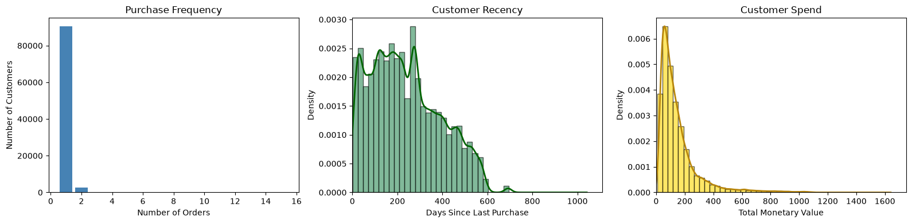
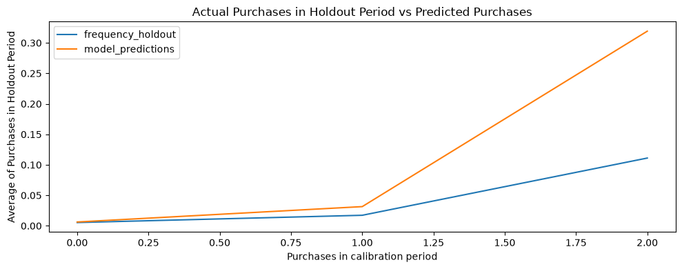

# Customer-Lifetime-Value-Prediction-Project

Customer Lifetime Value prediction project comparing probabilistic BTYD models and machine learning approaches for revenue forecasting and customer prioritization.

## Project Overview

This project analyzes customer purchasing behavior in the Olist e-commerce dataset to estimate future Customer Lifetime Value (CLTV).

The analysis compares a probabilistic BTYD approach based on BG/NBD and Gamma-Gamma models with machine learning regression models.

The project focuses on two main business objectives:

- **Financial planning:** estimate the future value of the customer base and identify the most reliable model for revenue forecasting.
- **Operational marketing:** identify high-value customers with a low probability of remaining active and prioritize them for targeted win-back campaigns.

## Dataset

The analysis uses relational tables from the Olist e-commerce dataset containing information about:

- Customers
- Orders
- Payments
- Order items

After preprocessing, the transactional dataset contains valid completed purchases that are aggregated at customer level for CLTV analysis.

The resulting customer-level table contains **93,357 customers** and includes behavioral variables such as:

- Recency
- Frequency
- Monetary Value
- Customer tenure

## Customer Behavior

The customer-level analysis shows:

- A strong concentration of customers with only one completed order.
- A wide distribution of customer recency.
- A strongly right-skewed spending distribution, with a small number of customers generating substantially higher value.

These patterns highlight limited repeat-purchase behavior and motivate the use of retention and win-back strategies.

## Methods

### Data Preparation

The preprocessing pipeline includes:

- Data quality assessment
- Missing-value analysis
- Duplicate and anomaly detection
- Filtering of completed transactions
- Removal of non-positive payment values
- Aggregation of payments and order items
- Integration of customer, order, payment and item information
- Customer-level feature engineering

### Probabilistic Modeling

The BTYD approach combines:

- **BG/NBD** to estimate future purchase frequency and probability of remaining active.
- **Gamma-Gamma** to estimate expected transaction value.

A calibration and holdout strategy is used to evaluate the ability of the probabilistic model to predict future purchasing behavior.

### BG/NBD Validation

The model is evaluated by comparing actual and predicted purchases during the holdout period.

### Machine Learning

Two regression models are trained using calibration-period customer features:

- Random Forest
- XGBoost

Hyperparameter optimization is performed using grid search with 3-fold cross-validation.

## Results and Insights

The probabilistic BTYD model, Random Forest and XGBoost are evaluated on the same customer subset and against the same actual holdout revenue.

### Final Model Comparison

| Model | MAE | RMSE |
|---|---:|---:|
| BTYD | 11.75 | 36.31 |
| Random Forest | 5.78 | 39.45 |
| XGBoost | 5.71 | 39.48 |

The comparison highlights a trade-off between average prediction accuracy and control of large prediction errors.

- **XGBoost achieved the lowest MAE (5.71)**, making it more suitable for customer-level ranking and short-term operational decisions.
- **Random Forest achieved similar performance**, with an MAE of 5.78.
- **BTYD achieved the lowest RMSE (36.31)**, suggesting better control of large prediction errors and greater suitability for customer-base valuation and financial forecasting.

## Win-Back Customer Prioritization

Predicted 90-day CLTV and probability alive are combined to identify customers with high expected value but low probability of remaining active.

The resulting priority segment contains:

- **10 high-value customers**
- **Average probability alive:** 0.06
- **Total predicted 90-day CLTV:** R$135.73
- **Average predicted CLTV:** R$13.57

Given the limited total expected value of this segment, the recommended strategy is a highly targeted and low-cost win-back campaign based on personalized reminders or small time-limited incentives.

## Tech Stack

**Language**

- Python

**Libraries**

- pandas
- numpy
- scikit-learn
- XGBoost
- lifetimes
- matplotlib

**Methods**

- Customer Lifetime Value Modeling
- BG/NBD
- Gamma-Gamma
- Random Forest Regression
- XGBoost Regression
- Grid Search
- Cross-Validation
- Customer Segmentation

## Project Materials

Additional materials for this project are available below.

- **Project Notebook:** Full CLTV analysis, probabilistic modeling, and machine learning pipeline. [Open notebook](CLTV_prediction.ipynb)
- **Project Presentation:** Presentation of the methodology, model comparison, results, and win-back strategy. [Open presentation](CLTV_prediction_presentation.pdf)

## Author

Irene Marrali

BSc in Artificial Intelligence @ Università degli Studi di Milano, Università degli Studi di Pavia, Università degli Studi di Milano-Bicocca
